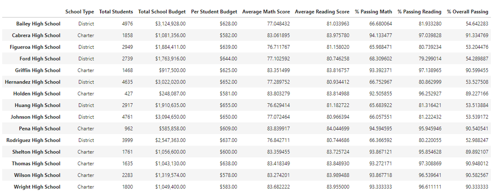
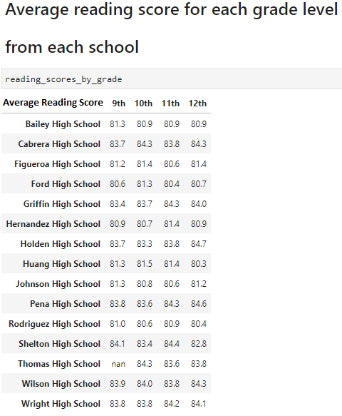

# School Distric Analysis

## Overview
Analyze performance trends and patterns regarding student funding and student’s standardized test scores to assist the school board and superintendent for a city school district in making decisions regarding school budgets.
In addition to the core analysis, there is evidence of academic dishonesty for one of the schools (Thomas High School). The ninth grade seems to be altered. Therefore, a new analysis needs to be run excluding math and reading scores for Tomas High School ninth grade and subsequently compare results. 

## Results

###	District Summary

- The District Summary is showing almost nothing difference in the Average Math Score, no difference at all in the Average Reading Score, and reducing only one percentage point for the Percentage Metrics Points.

###	School Summary

- The Scool Summary shows how is affected the Thomas High School metrics. While the Average for Math and Reading scores has a slightly difference, the percentage of passing Math, Reading and the Overall passing are showing a more substantial dropping going from mid-90s% to mid 60s% in each of the prior categories mentioned.

###	Top 5 Performing Schools (Based on Overall Passing Rate)

- As consequence of the analysis after excluding math and reading scores for Tomas High School ninth grade, the Thomas High School is not longer among the top five and we can see that it was replaced by the Wright High School.

###	Bottom 5 Performing Schools (Based on Overall Passing Rate)

- The Bottom five performance did not suffer any alteration after the second analysis. 

###	Average Math Score for each grade level from each school

- In this metrics the Tomas High School ninth grade is showed as NaN as result of the change in the data. No other metrics have been revised.

###	Average Reading Score for each grade level from each school

- In this metrics the Tomas High School ninth grade is showed as NaN as result of the change in the data. No other metrics have been revised.

###	Scores by School Spending (Per Student)

- In the Spending Range per student, we see that the Range $630-644 has suffered adjustments and the more affected metrics are the percentage in passing where Thomas High School is placed. 

 
###	Scores by School Size

- The Scores by school size has been affected in the Medium range (1000-2000) in the percentage passing metrics where Thomas High School is located. 

###	Scores by School Type

- The scores by the School Type are changing in the Charter category where Thomas High School belongs. 

## Summary

The biggest impact on the updated school district analysis is regarding the School Summary. The modified report shows a big drop in the Thomas High School % Passing Math from 93.3% to 66.9%, % Passing Reading from 97.3% to 69.6% and % Overall Passing from 90.9% to 65.1%.
Another big change is shown in the Top five performing Schools. The list has changed its elements and we can see that Thomas High School no longer belongs to this list. As a result, we can observe that a new element is compounding the list, Wright High School is now a member of the Top five performing Schools.
Other tow big modifications are located in the Average Math score for each grade level in each school and the Average Reading score for each grade level in each school. The Thomas High School is displayed in both list with NaN for the nineth grade because of the new analysis.
